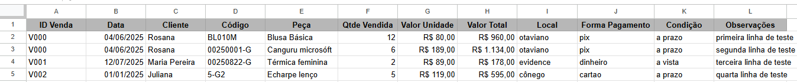
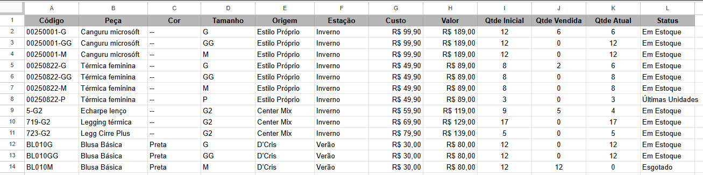

# Projeto: Ferramenta de Gestão Financeira e Controle de Vendas e Estoque para Pequenas Empresas

## Objetivo do Projeto

Este projeto acadêmico, desenvolvido no âmbito da disciplina de Inovação e Tecnologia, teve como objetivo diagnosticar e solucionar um problema real em uma pequena empresa.

## O Problema

Pequenas empresas frequentemente carecem de sistemas de gestão robustos devido ao alto custo e complexidade. Isso resulta em controles manuais, descentralizados e propensos a erros em áreas críticas como finanças, vendas e estoque, dificultando a visão estratégica e a tomada de decisões baseada em dados.

## A Solução Proposta

Para solucionar este desafio, foi desenvolvido um sistema de gestão integrado utilizando Google Sheets. A solução é composta por três módulos principais que trabalham de forma conectada:

1.  **Planilha de Operação Diária:** Registra todas as vendas, informações de clientes, produtos vendidos, pagamentos abertos, pagamentos recebidos e estoque atual. O sistema é projetado para que o estoque seja atualizado automaticamente com base nos registros da planilha de vendas.
2.  **Planilha de Entradas de Estoque:** Gerencia a entrada de produtos. O sistema é projetado para que o estoque seja atualizado automaticamente com base nas entradas de produtos.
3.  **Planilha de Fluxo de Caixa:** Consolida as informações financeiras, registrando todas as entradas (provenientes das vendas) e saídas (custos operacionais), permitindo uma visão clara da saúde financeira do negócio.

A ferramenta utiliza fórmulas avançadas para automatizar cálculos, gerar relatórios e criar um dashboard visual que se atualiza em tempo real, oferecendo uma visão gerencial completa e intuitiva.

## Ferramentas Utilizadas

* **Google Sheets:** Fórmulas avançadas (QUERY, VLOOKUP, SUMIFS), tabelas dinâmicas, validação de dados e formatação condicional.
  
## Screenshots da Ferramenta

**Tela do Controle de Vendas:**

**Tela do Controle de Estoque:**
 

**Lançamentos de Entradas e Saídas do Caixa:**

